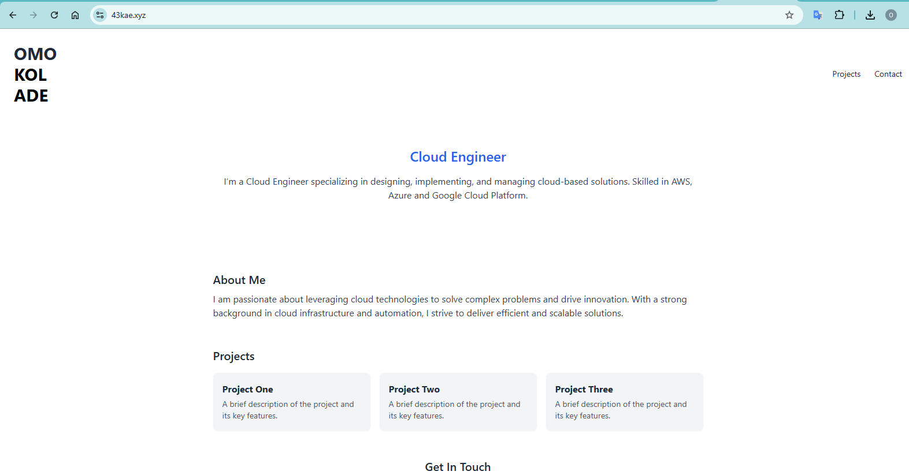

# 🌐 Omokolade's Cloud Portfolio (AWS S3)

This is a personal portfolio website hosted on **Amazon S3** using static site hosting and deployed via **AWS CLI**. It showcases cloud engineering skills and real-world use of AWS services.

---

## 🚀 Live Demo

🔗 [Visit Website](http://omokolade-portfolio-site.s3-website-us-east-1.amazonaws.com)

---

## 🧰 Stack Used

- **AWS S3** – For hosting
- **AWS CLI** – For deployment
- **Tailwind CSS** – For styling
- **HTML/CSS** – Core structure

## 🚀 Deploy Instructions
1. Create S3 bucket with static hosting enabled.
2. Upload files via AWS CLI.
3. Apply public-read bucket policy.
4. Access via AWS-generated endpoint.
